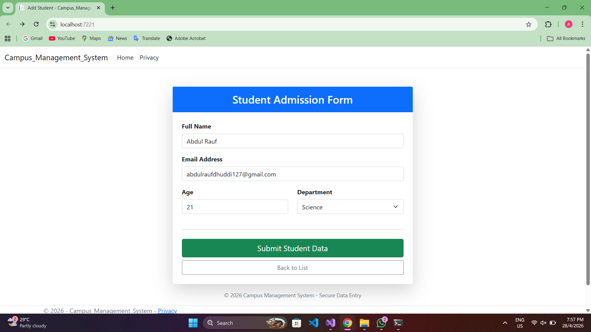
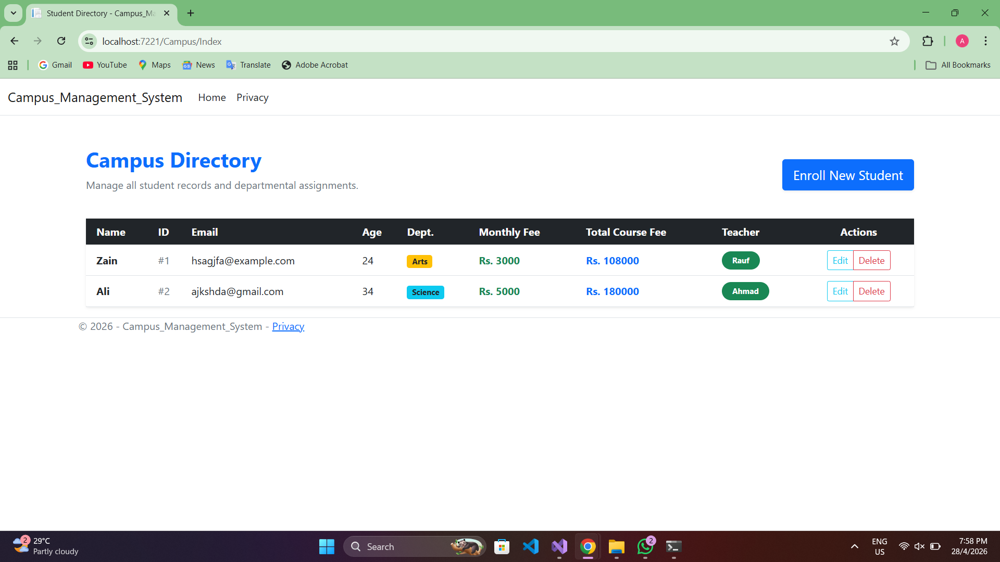
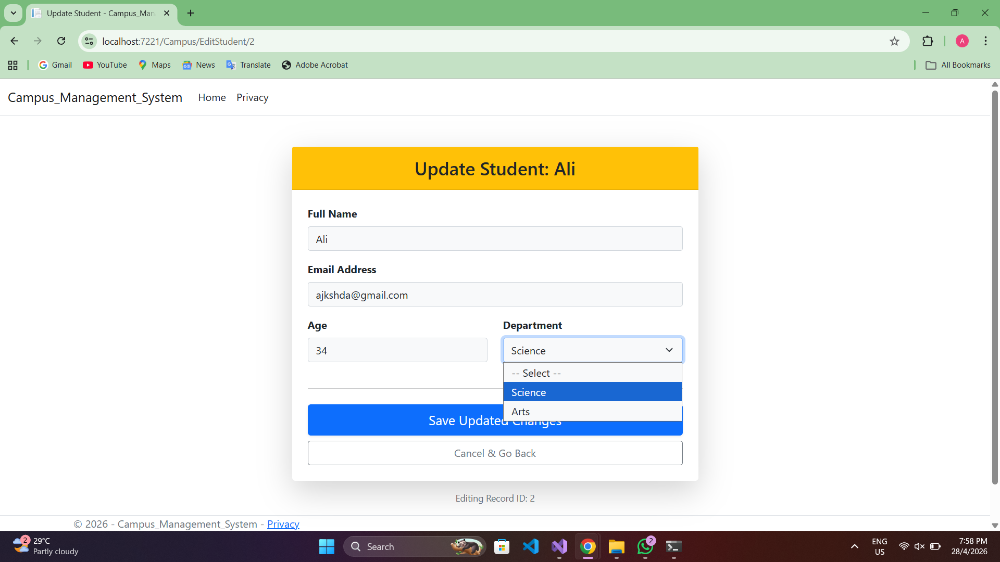
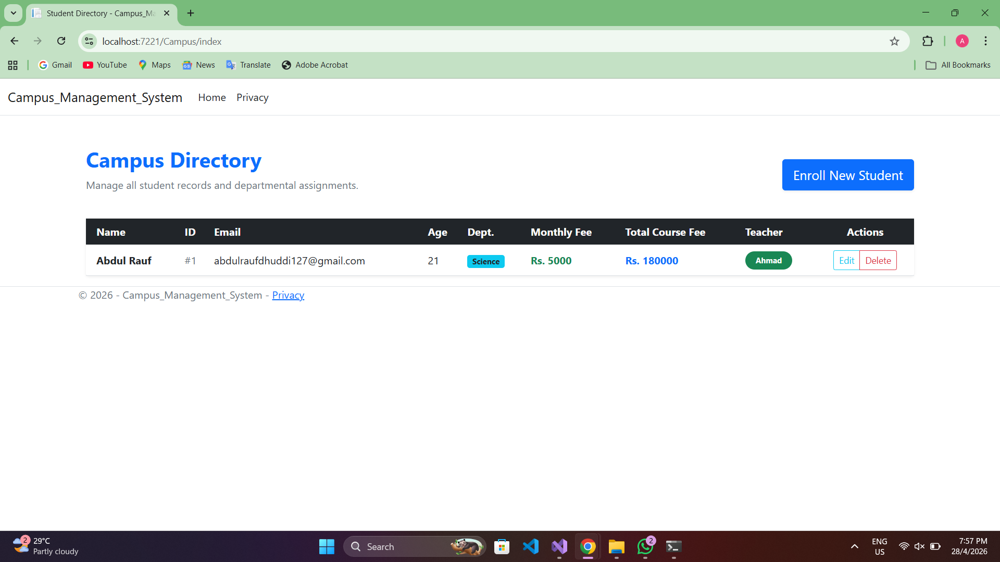
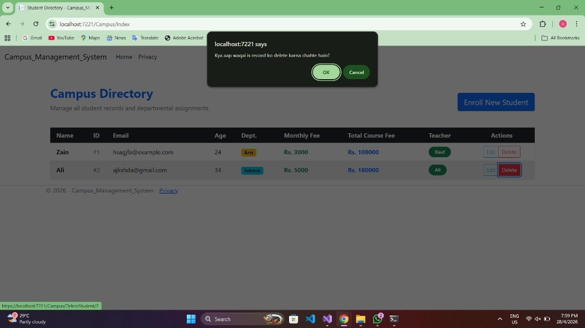

 **CampusManagementSystem**
 
A comprehensive Campus Management System built with ASP.NET Core MVC. Features include student registration, automated fee calculation based on departments, and a smart teacher assignment logic (load balancing). This project demonstrates CRUD operations, LINQ, Dependency Injection, and Custom Routing

## App Interface & Features (UI Gallery)
Here is a visual tour of the **Campus Management System** illustrating the complete Student CRUD cycle with the professional UI updates.

---

## 📸 App Interface & Features (UI Gallery)
---

## 📸 App Interface & Features (UI Gallery)

Check out the professional interface and the complete Student CRUD cycle:

### 1. Student Admission Form (Blank)
Used to enroll a new student.

***

### 2. Admission Form (Filled Details)
Data entry for a new student record (e.g., Abdul Rauf).

***

### 3. Campus Directory Dashboard
The main table view showing all enrolled students with departmental badges.

***

### 4. Update Student Record
The edit interface populated with existing student data.

***

### 5. Record Updated View
Dashboard view showing the updated student information.

***

### 6. Delete Confirmation Alert
JavaScript confirmation to prevent accidental deletion of records.

---
---
